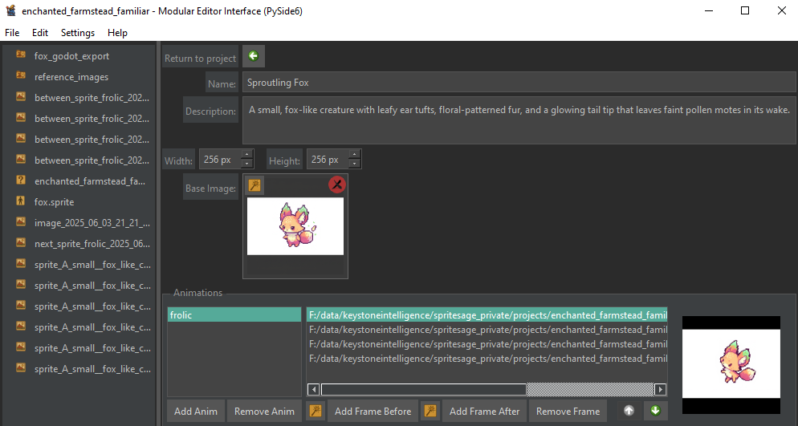
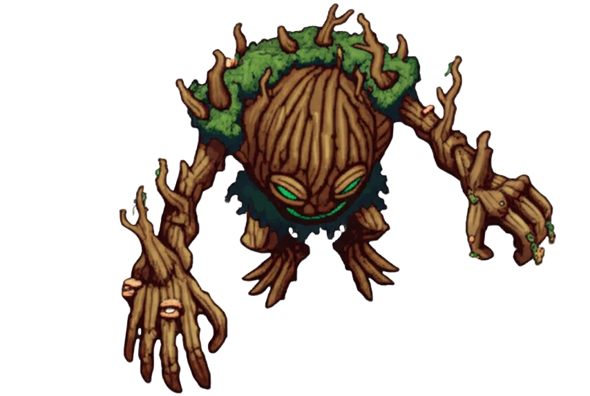
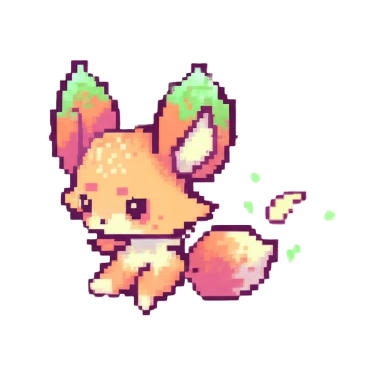
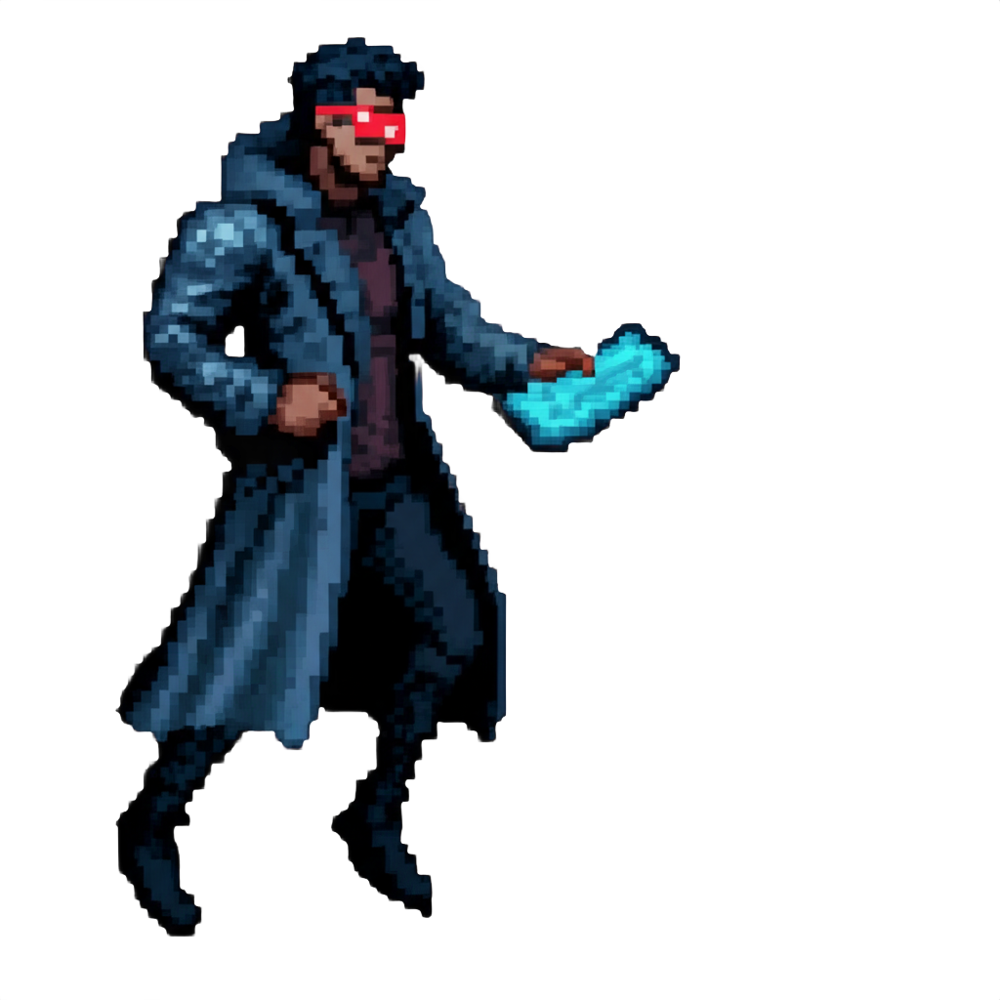
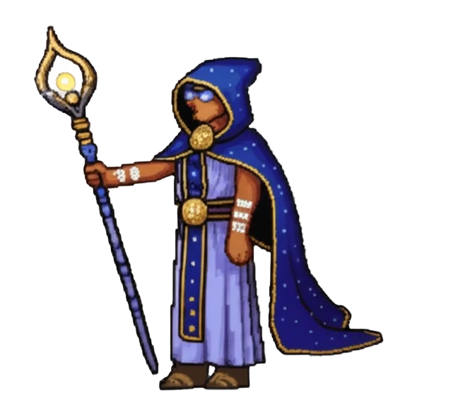

# 🧙‍♂️ Sprite Sage

**Enter a realm of pixelated magic.**

Sprite Sage is your generative AI-powered companion for crafting sprite assets and animations. Empowered with multi-provider AI support and a built-in Godot exporter, this open-source tool is forged for indie game developers to bring your ideas to reality.

## Preview

### Interface



### Sample Outputs

<p align="center">
  
  
  
  
</p>

## Key Features

- **AI-assisted creation**: Generate and edit sprites using configured OpenAI
  or Google models.
- **Sprite animation editing**: Organize animation frames, preview playback, and
  control whether a base image starts each animation.
- **Animated 3D model import**: Bake animations from a `.glb` model into
  transparent directional sprite frames using side, isometric, or top-down
  camera presets.
- **Project workflow**: Keep sprite definitions, reference images, generated
  assets, and exports together.
- **Godot 4 export**: Generate sprite sheets, `.tres` resources, and `.tscn`
  scenes.

## 3D Model Import

From an open Sprite Sage project, select **Import 3D Model...** under
**Sprite Actions**. Choose an animated `.glb`, select its animations and camera
preset, configure frame settings, and bake. The result is a normal `.sprite`
asset that opens in the existing editor.

The current importer targets a constrained animated GLB structure and is not a
complete glTF runtime. Unsupported models report an error rather than silently
producing invalid frames.

## Supported Files

- Projects: `.sage`
- Sprite definitions: `.sprite`
- Animated 3D input: `.glb`
- Images: `.png`, `.jpg`, `.jpeg`, `.bmp`, `.gif`, `.tiff`, `.webp`
- Godot output: `.tres`, `.tscn`, and sprite-sheet PNG files

## Build From Source

Use Python 3.10.

```powershell
python -m venv venv
venv\Scripts\activate
python -m pip install -e ".[dev]"

# Run from source
spritesage

# Build the Windows executable
venv\Scripts\python.exe -m PyInstaller --clean main.spec
```

The executable is written to `dist/spritesage.exe`.
See [BUILD.md](BUILD.md) for complete build requirements.

## Developer Checks

```powershell
venv\Scripts\python.exe -m pytest
venv\Scripts\python.exe -m black --check src tests
venv\Scripts\python.exe -m ruff check src tests
```

Pyright is available as a cleanup tool but is not yet a required project-wide
gate because the repository has a pre-existing typing baseline.

## Roadmap

| Feature | Description |
|---|---|
| Animation templates | Create characters from reusable sprite templates without requiring a 3D model |
| AI style pipeline | Apply consistent project-specific styling across animation frames |
| Broader 3D support | Support more glTF structures, materials, and animation layouts |
| Pixel editor | Make quick image corrections inside Sprite Sage |
| Quality of life | Add batch operations, cloning, progress detail, and general polish |

## AI Configuration

Open **Settings -> LLM Settings** to configure provider API keys and select
discovered text and image models. See [MODEL_REFRESH.md](MODEL_REFRESH.md) for
model discovery behavior.

## License

Sprite Sage is released under the
[GNU General Public License v3.0](LICENSE). Third-party components are
acknowledged in [THIRD_PARTY_LICENSES.md](THIRD_PARTY_LICENSES.md).

## Contributing

See [CONTRIBUTING.md](CONTRIBUTING.md) for development requirements.

## Links

- [Sprite Sage website](https://www.keystoneintelligence.ai/spritesage)
- [Itch.io page](https://keystoneintelligence.itch.io/spritesage)
