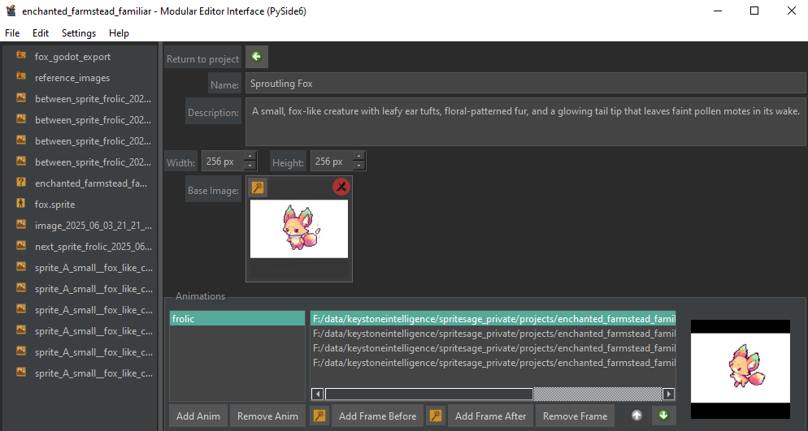
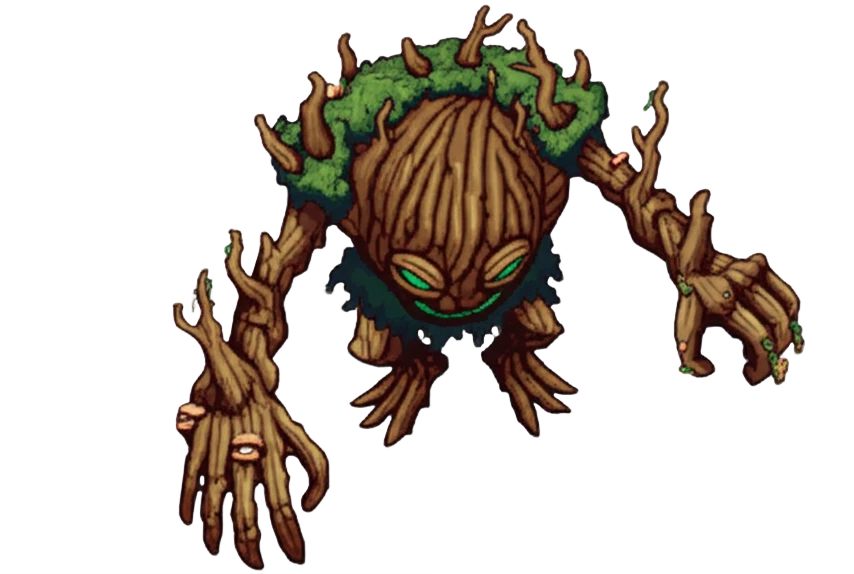
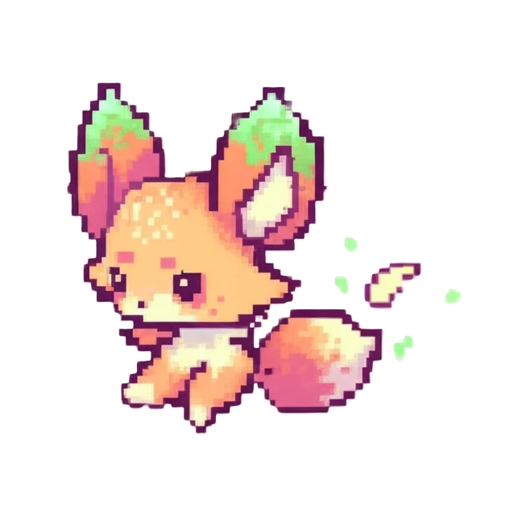
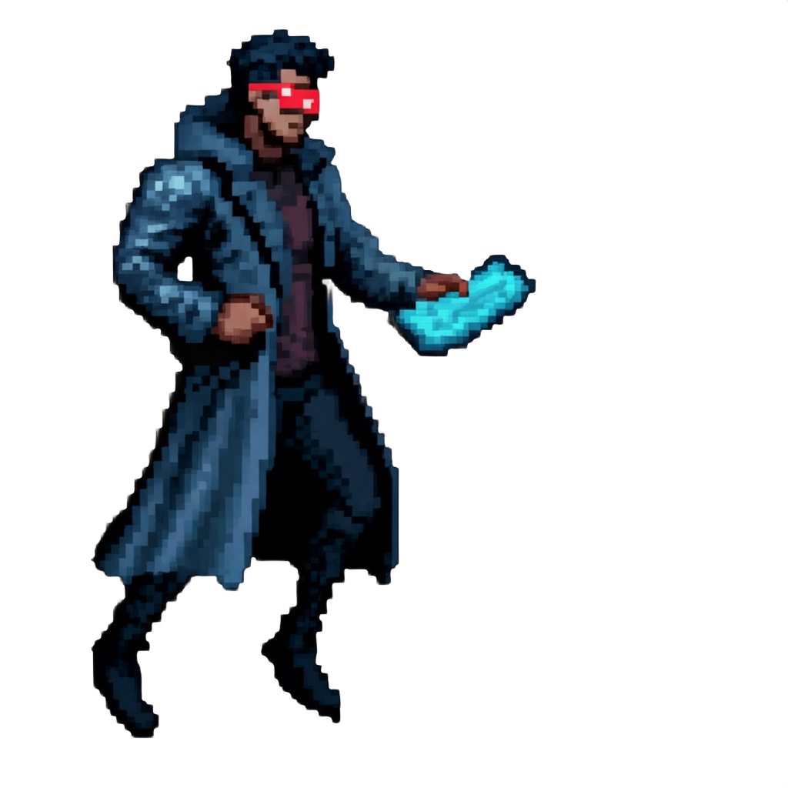
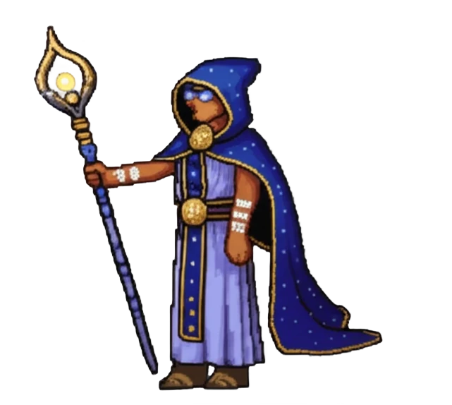

# 🧙‍♂️ Sprite Sage

**Enter a realm of pixelated magic.**

Sprite Sage is your generative AI-powered companion for crafting sprite assets and animations. Empowered with multi-provider AI support and a built-in Godot exporter, this open-source tool is forged for indie game developers to bring your ideas to reality.

## Preview

### Interface



### Sample Outputs

<p align="center">
  
  
  
  
</p>

## Key Features

- **AI-assisted creation**: Generate and edit sprites using configured OpenAI,
  Google, or local models.
- **Sprite animation editing**: Organize animation frames, preview playback, and
  control whether a base image starts each animation.
- **Animated 3D model import**: Bake animations from a `.glb` model into
  transparent directional sprite frames using side, isometric, or top-down
  camera presets.
- **Animation transfer (experimental)**: Give a character the motions of a 3D
  template. The image model selected in Preferences redraws each pose using a
  shared character reference; Sprite Sage creates editable animations, sprite
  sheets and GIFs, with resume support for long jobs. The Bandit Humanoid
  motion template is included. See the [animation transfer guide](docs/animation-transfer.md).
- **Project workflow**: Keep sprite definitions, reference images, generated
  assets, and exports together.
- **Godot 4 export**: Generate sprite sheets, `.tres` resources, and `.tscn`
  scenes.

## Local image generation

In **Preferences → LLM Settings**, select **LOCAL**, then **Manage local models…**.
Choose a model from the catalog, review its license, and select **Install model**.
Only that model and its declared helper models are downloaded. Setup installs
missing engines and reuses compatible installed engines for subsequent models.
Choose **Use model**, then save LLM Settings to select it for generation.
Installing another model does not change your current selection.

The catalog shows each model's installation status. Engine/model locations,
hardware overrides, image size, and sampling steps are under the collapsed
**Advanced** section; the normal flow uses defaults. Verification happens during
setup. **Model options** provides verification and removal actions.

The first curated model is **Qwen Image 2.1 INT8**, supporting image generation
and reference-based editing. Automatic setup currently targets Windows x64 with
an NVIDIA GPU. Allow about 41 GiB for engines, downloads, and 27.4 GiB of
weights; 512 × 512 is the recommended starting size. Older GPUs can take several
minutes per image. The model's research/evaluation license requires a separate
license for commercial use; the setup dialog links to its terms.

If ComfyUI is already installed, choose **Use an existing installation…**.
Browse to its installation (or models folder); its Python executable and models
are discovered automatically. Adjust locations under Advanced if needed, then
select **Verify model**. Model Manager
checks every required file against the pinned revision before enabling use.
Existing ComfyUI files and Hugging Face snapshots can be reused without copying;
external files cannot be removed through Model Manager. Removal of a managed
download affects every application using that shared cache.

Image generation runs locally, with progress and cancellation. Text assistance
defaults to **Off**; you can enter descriptions manually or explicitly select
Google/OpenAI for text requests. Switching back to a cloud provider keeps its
existing configuration and image workflow.

Qwen includes automatic prompt improvement: one helper handles creation and the
other handles references. Each helper exits before image generation starts.
Existing image-only setups offer **Add prompt enhancement**; existing helper
files can be verified and reused. The toggle and optional folder overrides are
under **Advanced**. A failed rewrite offers an explicit retry with the original
prompt. Shared prompt tools and engines are retained when removing an image model.

The lightweight Model Manager package is included in Sprite Sage. The larger
generation engine and weights are installed only when requested. All runtime,
cache, catalog, and ComfyUI logic lives in that separate package. See
[local generation architecture](docs/local-generation.md) for development and
cache details.

## Animation workspace

Open a sprite's **Animations** tab to work with a thumbnail timeline. Drag a frame
between thumbnails to reorder it, or use the earlier/later arrows. Changes save
automatically and support Undo/Redo. **Add frames** contains import and AI insertion
commands; **Sequence** contains Reverse and Ping-Pong. Full image paths are available
in thumbnail tooltips, and missing images keep their place in the sequence.

Use **Play/Pause** or Space with the timeline or preview focused. Left/Right in the timeline
steps one frame and pauses playback. **FPS** and **Loop** are saved per animation
and apply to preview and Godot export. Turn Loop off to play once and hold the
last frame; Play starts again after completion. Select a thumbnail to edit its
**Frame duration** in milliseconds, or use **Reset** for the default `1000 / FPS`.
Changing FPS scales all frame durations together. Duration editing is available
while paused, and timing follows frames through reorder, duplicate, reverse,
ping-pong, and Undo/Redo.

**Include base image** adds a fixed leading frame to playback and export;
the **Base** button selects it and lets you edit its duration for each animation.
The timeline shows individual frame durations and the total animation length.

Aseprite JSON imports preserve frame timing, forward/reverse/ping-pong direction,
and repeat settings. Animated GIF/WebP imports retain their frames and timing;
finite repetitions become a finite sequence with Loop off. Plain image sequences
and grid sheets start at 2 FPS with Loop on. Model bakes preserve sampled timing
and loop settings through both direct and project export, including partial final
frames and frame-limited bakes.

Sprites now save as [version 2 of the `.sprite` format](docs/sprite-format.md).
Older files open with the previous preview defaults (2 FPS, equal frame durations,
Loop on) and upgrade when saved. Older Sprite Sage versions cannot read version 2.

**Zoom** offers Fit and integer magnifications from 1× to 16×, with scrollbars for
large images. **View** controls the transparency checkerboard and pixel-art mode.
Pixel-art mode uses nearest-neighbor rendering and sprite-sheet resizing, and sets
nearest filtering in exported Godot scenes. Turn it off for smooth artwork. This
setting is saved per sprite and also appears in **Info → Rendering**; older sprites
without a rendering setting default to pixel-art mode.

The console starts collapsed. Open it with the **Console** button, **View → Console**,
or Ctrl+backtick. Resize the sidebar, preview, timeline, and console by dragging
their dividers; panel sizes and console visibility are remembered when the app closes.

## 3D Model Import

From an open Sprite Sage project, select **Import 3D Model...** under
**Sprite Actions**. Choose an animated `.glb`, select its animations and camera
preset, configure frame settings, and bake. The result is a normal `.sprite`
asset that opens in the existing editor.

The current importer targets a constrained animated GLB structure and is not a
complete glTF runtime. Unsupported models report an error rather than silently
producing invalid frames.

## Saving and recovery

Project and sprite edits save automatically. Routine successful saves do not
show a badge; failed saves are reported while your edits remain open.
Use **Edit → Undo/Redo** and their usual shortcuts to reverse individual edits.

For recovery after a restart or a damaged file, use **File → Recover saved version…**.
Each `.sage` or `.sprite` document keeps one checkpoint of its contents before its
first edit in a session. A session is one run of Sprite Sage: later autosaves,
Undo/Redo, and switching files leave that checkpoint intact. After restarting,
the old checkpoint stays available until the file's first edit creates the new
session's checkpoint. Opening a file or saving it unchanged does not replace it.

The recovery dialog shows the checkpoint's save time and explains what it contains.
Recovering a readable document adds one **Recover saved version** action to Undo,
so you can reverse recovery without losing earlier undo history. Recovery keeps
the checkpoint unchanged. If the current file is damaged, a separate `.damaged`
copy is preserved before replacement. The checkpoint and any damaged copy live
in a sibling `.spritesage-recovery` folder. They cover document metadata and image
references, not copies of image assets or whole-project backups.

Preferences live in `Sprite Sage/preferences.json` inside your OS application-data
directory (`%LOCALAPPDATA%` on Windows, `~/Library/Application Support` on macOS,
and `$XDG_DATA_HOME` or `~/.local/share` on Linux). API keys use the OS credential
store through [keyring](https://keyring.readthedocs.io/en/stable/): Windows Credential
Locker, macOS Keychain, or Linux Secret Service. Linux requires an available,
unlocked Secret Service. There is no plaintext credential fallback.

On upgrade, Sprite Sage imports `.sagesettings` from the launch directory and
removes its API-key fields only after secure storage succeeds. If the credential
store is locked or migration fails, the original is kept and a visible warning
explains how to retry. Preferences, recent-project updates, and recovery snapshots
do not write API keys.

## Supported Files

- Projects: `.sage`
- Sprite definitions: `.sprite`
- Animated 3D input: `.glb`
- Images: `.png`, `.jpg`, `.jpeg`, `.bmp`, `.gif`, `.tiff`, `.webp`
- Godot output: `.tres`, `.tscn`, and sprite-sheet PNG files

## Build From Source

Use Python 3.10.

```powershell
python -m venv venv
venv\Scripts\activate
python -m pip install -e ".[dev]"

# Run from source
spritesage

# Build the Windows executable
venv\Scripts\python.exe -m PyInstaller --clean main.spec
```

The executable is written to `dist/spritesage.exe`.
See [BUILD.md](BUILD.md) for complete build requirements.

## Developer Checks

```powershell
venv\Scripts\python.exe -m pytest
venv\Scripts\python.exe -m black --check src tests
venv\Scripts\python.exe -m ruff check src tests
```

Pyright is available as a cleanup tool but is not yet a required project-wide
gate because the repository has a pre-existing typing baseline.

## Roadmap

| Feature | Description |
|---|---|
| Animation templates | Create characters from reusable sprite templates without requiring a 3D model |
| AI style pipeline | Apply consistent project-specific styling across animation frames |
| Broader 3D support | Support more glTF structures, materials, and animation layouts |
| Pixel editor | Make quick image corrections inside Sprite Sage |
| Quality of life | Add batch operations, cloning, progress detail, and general polish |

## AI Configuration

Open **Settings -> LLM Settings** to configure provider API keys and select
discovered text and image models. See [MODEL_REFRESH.md](MODEL_REFRESH.md) for
model discovery behavior.

## License

Sprite Sage is released under the
[GNU General Public License v3.0](LICENSE). Third-party components are
acknowledged in [THIRD_PARTY_LICENSES.md](THIRD_PARTY_LICENSES.md).

## Contributing

See [CONTRIBUTING.md](CONTRIBUTING.md) for development requirements.

## Links

- [Sprite Sage website](https://www.keystoneintelligence.ai/spritesage)
- [Itch.io page](https://keystoneintelligence.itch.io/spritesage)
