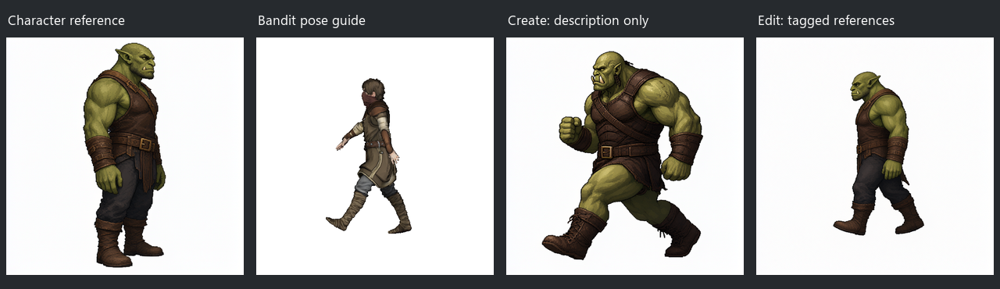
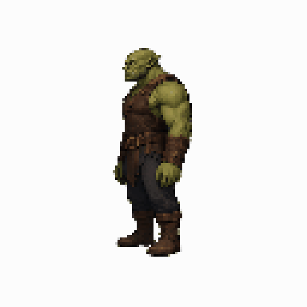
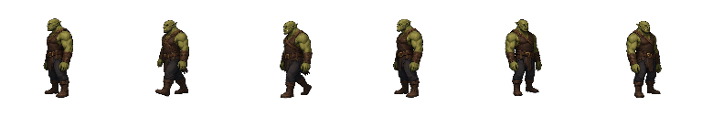
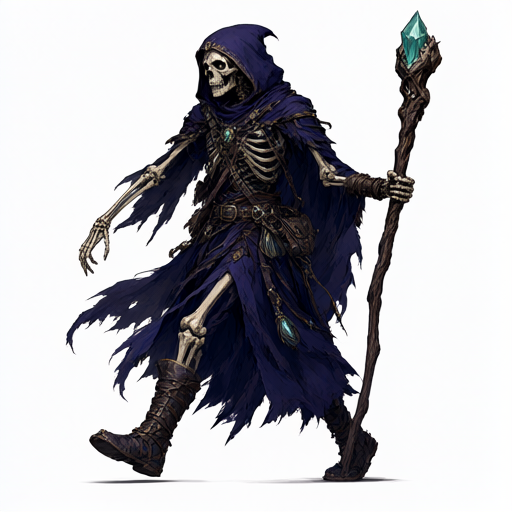
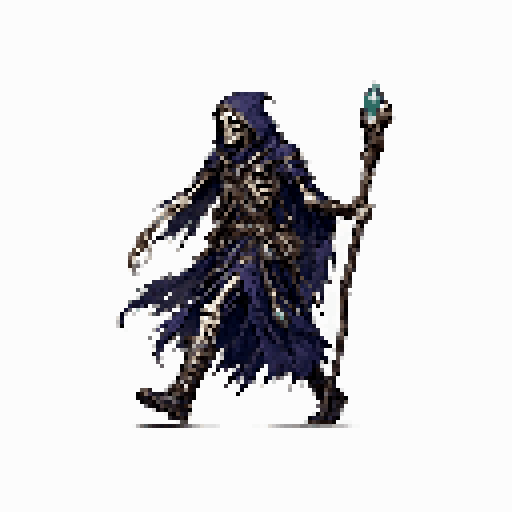
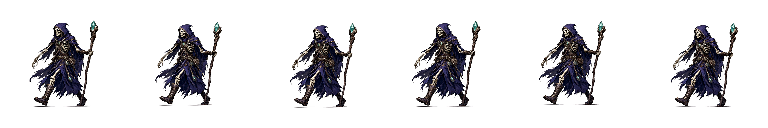

# Local Qwen animation-transfer experiment

The first experiment uses the existing Bandit humanoid's Walking clip and a green orc character generated locally with Qwen Image 2.1 INT8. The motion runs for 1.033 seconds; six samples cover the full cycle from the model's right-side camera.

## Create versus edit

Both modes used the same installed model, 512 × 512 generation, 25 sampling steps and seed 4817. Qwen exposes a unified local workflow: creation omits reference images, while editing supplies them. Creation used the installed prompt helper; editing used explicit fixed instructions. These are representative qualitative trials, not a statistical benchmark.

| Mode | Result on the stride test | Elapsed time |
| --- | --- | --- |
| Create from a pose/character description | Strong action pose, but changed face, proportions, clothing and camera angle; trousers became exposed legs. | 246 s including prompt improvement |
| Edit with pose + character references | Retained the reference orc and outfit, corrected facing and produced a walking stride. Arm placement remained approximate. | 271 s |

**Use creation for the character design, then editing for the animation experiment.** Independent creation offers too much variation for identity-sensitive frames. Editing preserves identity better, but neither approach demonstrated reliable animation-ready output in these trials.

The initial untagged edit trials either copied the standing character or preserved the source bandit. Qwen's [official editing instructions](https://github.com/QwenLM/Qwen-Image-2.1/blob/main/prompt_rewrite/prompts/system_prompt_edit.txt) require `<image1>`, `<image2>` references. The implementation uses these tags and separates the pose canvas from the identity reference. It also avoids confusing a camera's side with the character's screen-facing direction.

## Completed walking sequence

The complete production run generated six distinct transparent 128 × 128 frames, a 768 × 128 sheet and a looping 512 × 512 GIF. It took **27 minutes 31 seconds** on the installed GTX 1070 configuration, excluding the initial character image and comparison probes. GIF timing is 1.030 seconds against the source clip's 1.033 seconds, accounting for GIF's 10 ms timing resolution.

This is an uncurated experiment: all six outputs are retained in source order. The first four face left and show some leg movement, while the final two revert toward the reference's standing pose and right-facing angle. Arms and armor also vary. **The pipeline works, but this result is not a finished game-ready walking cycle.** File integrity, transparency and timing checks cannot establish visual pose adherence.

Further quality work should test a character reference matching each selected camera angle, explicit per-pose descriptions, and a model/workflow with stronger pose conditioning. The current fixed-reference image-editing approach should remain experimental until those tests demonstrate consistent motion.

The [follow-up pose-transfer lab](pose-transfer-experiments.md) compares direct pose descriptions, local text-model rewriting, a projected skeleton guide, and other controlled changes side by side on two difficult frames.

## Verification

The production service renders the poses, submits one local edit per frame, aligns the outputs to the pose guides, and creates transparent frames, a sheet, GIF and editable Sprite Sage animation. The full suite passed with **414 tests and 3 environment-dependent skips**. Tests cover timing, multiple directions, cancellation, saved-job restoration, verified frame reuse, corrupt-frame recovery, filename isolation, and undoable editor integration. A packaged-app diagnostic confirmed that a second invocation cannot enter an already-running job, then reopened the completed job in 8.4 seconds with **zero generated frames and six verified reused frames**. Native motion preview and editor layouts were also checked visually.

The bandit source is a separately registered local asset; it is not redistributed in this repository. Generated examples below are the AI outputs, not the 3D source model.

## Skeleton mage workstream repeat

The same Bandit `Walking` clip was run through the packaged Sprite Sage workflow with a new skeleton mage wizard. The character reference was created with local Qwen Image 2.1 INT8, then used for six pose-guided edits at 512 × 512 and 25 sampling steps. The animation was saved at 128 × 128 and 8 FPS. Prompt improvement was enabled, and the first pass used seed 4817 for each frame.

The six output files are distinct, but the character scarcely moves. In adjacent 512 × 512 frames, only **0.16–0.30%** of mage pixels changed by more than 20 in any RGB channel, compared with **7.3–8.0%** of pixels in the adjacent Bandit renders. These figures describe visible pixel change, not anatomical pose accuracy; the side-by-side review also shows the mage repeatedly copying its character reference's wide stride instead of the Bandit's changing leg and arm positions.

The frame-review retry was exercised on the first, near-standing pose. With explicit boot-placement feedback and seed 4818, Qwen produced a much closer side-profile passing pose, but changed the mage's scale, robe and equipment and removed the staff. Both candidates were retained; the original was reselected to avoid one visually inconsistent frame in the draft. Reopening the completed job reused all six verified frames without generation, and the six-frame Sprite Sage `.sprite` file was saved and reloaded successfully. **This remains an experimental draft, not an animation-ready sprite.** The local side-by-side GIFs and retry comparison are kept in the ignored workstream output because they include renders of the separately held Bandit asset.
