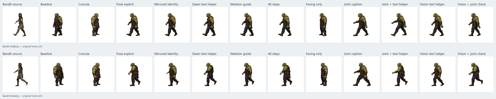

# Bandit-to-orc pose-transfer experiments

The first six-frame Bandit Walking transfer drifted from the source pose, especially near the end of the cycle. This lab compares local Qwen Image 2.1 INT8 edits against the same green-orc identity image and two difficult Bandit frames: frame 2 has a long stride; frame 6 has a planted front foot and raised rear boot.

[Open the interactive comparison](examples/pose-transfer-lab/explorer.html) to pause or scrub all methods together and inspect each edit prompt. Each card links to an individual GIF that switches between the *same two diagnostic poses*; these two-frame loops are not complete walking cycles. The [contact board](examples/pose-transfer-lab/all-experiments.png) keeps both poses visible at once.

## Controlled setup

All new trials use the same rendered Bandit pose as `<image1>`, the same orc identity as `<image2>`, 512 × 512 Qwen Image 2.1 INT8 editing, seed 4817, and 25 inference steps unless named otherwise. The two outputs are prepared by the production 128 × 128 frame-cleanup routine. This compares prompting and reference layout without changing the Sprite Sage UI. The original six-frame transfer is shown as the baseline. A generated result takes roughly five minutes per frame on the test GPU; the text helper adds roughly two minutes of reasoning per frame.

The [official Qwen Image 2.1 README](https://github.com/QwenLM/Qwen-Image-2.1) demonstrates 40 steps and recommends its dedicated editing prompt rewriter. Its [rewriter instructions](https://github.com/QwenLM/Qwen-Image-2.1/blob/main/prompt_rewrite/prompts/system_prompt_edit.txt) require numbered image tags and explicit image roles. All edits here use those tags and image roles; the 40-step variant isolates the sampler setting.

| Variant | Hypothesis |
| --- | --- |
| Baseline | Existing production transfer prompt, with no frame-specific description. |
| Concise | A short edit prompt that explicitly assigns pose to image 1 and identity to image 2. |
| Pose explicit | Direct prompt with screen-facing direction, foot contact, leg spread, and arm position for each frame. |
| Mirrored identity | Flip the orc reference to the Bandit's on-screen facing direction, then use the explicit prompt. |
| Qwen text helper | Use the local Qwen text helper to rewrite a pose-specific edit prompt before image generation. |
| Skeleton guide | Add the animated GLB's projected joints as a third image reference to the explicit prompt. |
| 40 steps | Use the explicit prompt with 40 instead of 25 image inference steps. |
| Facing only | Add only the Bandit's screen-facing direction to the concise prompt. |
| Joint caption | Derive direction, stride, raised boot, and arm swing from the animated GLB's projected joints; describe them in the edit prompt. |
| Joint + text helper | Have the local Qwen text helper rewrite the automatically derived joint caption, without hand-written frame notes. |
| Vision text helper | Have the local Qwen text helper infer pose facts directly from the source image, without hand-written notes or a rig-specific joint map. |
| Vision + joint check | Let the vision helper describe the image, with rig-verified foot contact and exact screen placement supplied as constraints. |

The joint-caption trial is the scalability test. It uses semantic joints from this humanoid rig rather than hand-written descriptions of the two Bandit images. Other rigs would need a validated joint-name mapping or a fallback caption source.

## Findings

The lower-half foreground overlap below is a rough proxy for leg placement, **not a pose-accuracy score**. It is affected by the orc's proportions, clothing, and cleanup. Inspect the linked GIFs for foot contact and arm position.

| Variant | Frame 2 | Frame 6 | Visible result |
| --- | ---: | ---: | --- |
| Baseline | 0.447 | 0.406 | Late frame reverts toward standing identity. |
| Concise | 0.380 | 0.406 | Standing identity dominates both edits. |
| Pose explicit | 0.663 | 0.528 | Both pose types appear; arms remain approximate. |
| Mirrored identity | 0.631 | 0.496 | No gain from flipping the reference. |
| Qwen text helper | **0.682** | **0.676** | Best of these trials; source pose facts were hand-written. |
| Skeleton guide | 0.660 | 0.582 | Similar to explicit prompt with a third reference. |
| 40 steps | 0.671 | 0.504 | Little pose change for more inference time. |
| Facing only | 0.321 | 0.404 | Faces left but stays close to standing. |
| Joint caption | 0.517 | 0.375 | Stride too wide; raised boot becomes planted. |
| Joint + text helper | 0.436 | 0.506 | Rear boot lifts; stride and hand reach exaggerate. |
| Vision text helper | 0.654 | 0.612 | Rear boot misread as a toe touching the ground. |
| Vision + joint check | 0.538 | 0.630 | Corrects boot contact, but first pose is less aligned. |

The original production result loses the Bandit's left-facing pose by frame 6. A short edit prompt also favors the standing orc reference. Adding only “face screen left” fixes orientation on the first diagnostic frame but leaves the feet close together. The explicit prompt and its text-helper rewrite both recover the wide stride and the raised rear boot. In these two frames, flipping the identity reference does not improve on the unflipped explicit prompt. A third skeleton image follows the motion but shows only a small gain over the explicit prompt, at additional model time.

The hand-guided text-helper rewrite has the strongest visual match on both diagnostic frames. Its result is still an approximation: arm swing and clothing details vary, and these two frames do not establish a stable six-frame cycle. The direct joint-caption variant gets the broad stride in frame 2 but exaggerates its width. On frame 6 it misses the raised rear boot entirely, planting both feet. Basic projected-joint facts are too coarse to become the default on this evidence.

The vision-only text helper correctly describes the long stride in frame 2, but calls frame 6's lifted rear boot a toe touching the ground. The generated orc repeats that lower foot position. This isolates a prompt-interpretation error before image editing. Visual pose reading is promising but should not be assumed correct for subtle foot contact.

Combining the vision helper with rig-verified foot contact repairs the raised-boot mistake in frame 6, but the first frame remains less aligned than the manually guided prompt. Giving the helper a broad joint caption also lifts the rear boot yet exaggerates stride and arm reach. Raising image sampling from 25 to Qwen's documented 40 steps produces little visible pose change, while each image takes longer. The third skeleton reference is similarly not a clear enough gain to justify making it part of every edit.

The practical next prototype is a **pose-grounded edit recipe**, rather than a longer generic prompt: extract screen-facing direction and foot-contact facts from each animated rig frame, ask the vision helper for detailed limb language, reject contradictions against the rig, and avoid wording that amplifies stride length. A second-stage pose check should compare the resulting frame with the rendered guide and request a targeted retry when a boot or hand is wrong. The current foreground-overlap proxy is not sufficient for that check on its own. If this still cannot hold a six-frame cycle, test a pose-conditioned image workflow that is explicitly compatible with Qwen Image 2.1 or another local model. The [official Qwen Image 2.1 documentation](https://github.com/QwenLM/Qwen-Image-2.1) describes image editing and visual annotations, but does not document a native ControlNet pose input; compatibility should be verified rather than assumed.

The silhouette overlap numbers in the experiment record are only a rough comparison of prepared foreground masks. Orc proportions, clothing, cleanup, and character placement affect them; they do **not** measure skeletal accuracy or animation quality. The visual comparisons remain the primary evidence. Two frames and one seed per method are enough for a directional prototype, not a reliability claim across motions, characters, or seeds.
